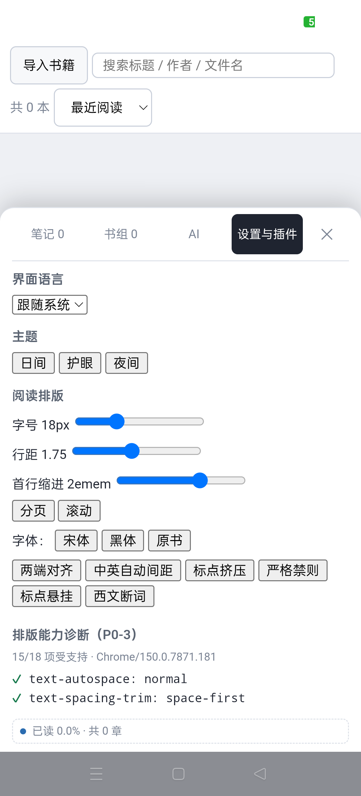

# JingJing

A local-first desktop and Android reader. Your books, highlights, reading positions and AI key all stay on your own device.


Windows 10/11 · [Download the latest release](https://github.com/54RuiCao/JingJing/releases/latest) · MIT

[中文](README.md#中文) · English · [Bilingual page](README.md)

The interface follows your system language (Chinese / English) and you can switch it any time under Settings.

## Reading

- Import EPUB / TXT / MOBI / FB2 / CBZ; TXT is converted to EPUB on import
- Table of contents, full-text search, highlights / notes / bookmarks and reading position are stored in a local SQLite file — works offline
- Three themes (day / sepia / night); font size, line height, page width and justification are all adjustable
- Group books into shelves; the home sidebar has a cross-book note overview (click a note to jump back to the passage) and shelf management


## Android (beta)



The phone build shares the same codebase, but its interface is a **separate design for narrow screens**
(not the desktop layout squeezed down):

- **Bottom navigation with three tabs**: Home / Library / AI — a centred floating glass pill. Scrolling down
  collapses it into a small circle showing the current tab; scroll up or tap it to expand.
  **You can also swipe left/right between the three pages.**
- **Home**: three sections — Continue / Want to Read / Finished (each on a soft gradient card) — with a
  "Reading Goals" card at the bottom (today's reading time vs. a daily goal).
- **Library**: two large cover columns; under each cover a format chip and a ••• menu (group / remove live
  there); three round buttons top-right for sort / import / settings.
- **Reader**: **tap the middle once** to bring up two floating bars — the top one holds back / contents /
  type size / search / bookmark, the bottom one is just a floating "ask something" field that opens the AI.
  Both bars hide again as soon as you turn a page. The page number sits in the bottom-right corner of the
  text, and all typography (type size — typed in directly — line height, indent, paper colour, paged vs.
  scrolling) lives in the "Aa" panel.
- **AI**: inside the reader it is a **half-screen card** floating over the lower half of the page (your
  reading position is untouched); on Home/Library it is a full page. Capabilities, plugins and tools are
  identical to the desktop build.
- **Full screen**: the app hides the system navigation bar on launch (swipe from the edge to bring it back
  temporarily), so the bottom bar can sit right at the bottom.

- **Install**: download `鲸鲸-安卓测试版-0.1.0.apk` (9.4 MB, Android 7+, arm64). The system will warn about
  an unknown source — allow it once (self-signed build, not from a store).
- **Controls**: swipe or **tap the left/right edge** to turn pages, tap the middle to toggle the bars,
  pinch to zoom, and the back gesture closes the panel first, then returns to the shelf.
- **Features**: library, reading, highlights and notes, full-text search, AI and plugins (9 built-in) are
  the same as on the desktop; plugin bundles are imported by pasting JSON or picking a `.json` file.
- **Limits**: no PDF, no book sources, no DRM removal; this is a self-signed beta build.

Both the Windows and the Android builds live in the same [release](https://github.com/54RuiCao/JingJing/releases/latest).

## AI

Bring a DeepSeek key, or point it at any OpenAI-compatible endpoint, or a local Ollama.

- The whole book goes into context chapter by chapter, and `[CH 12]` inside an answer jumps back to the source
- Tools can read chapters, search the full text, write highlights and notes, and jump around the book; every call, its tokens and its cost are shown in the panel
- Very long books fall back to "table of contents + fetch chapters on demand"

The first question about a book is the expensive one — the whole book is read into context. After that it is cached and cheap.

## Plugins

Every part of the interface and every AI tool is a plugin. Built-in and third-party plugins go through the same load, unload and rollback path.

**The AI can write one for you on the spot.** Ask it to "add a strip at the bottom of the reading area showing how many pages are left in this chapter": it looks up the API and the slots available, writes the plugin, runs it, then stops and waits for your grant (nothing is granted by default). Happy with the result? "Keep in plugin folder" makes it permanent, just like a built-in.

Plugins run in a quickjs-ng (WASM) sandbox: every capability has to be declared in the manifest, everything is denied by default, and revoking a grant stops the plugin immediately. Network access works the same way — a plugin declares the domains it wants and you grant them one by one. A plugin can also use the AI key you configured: the host fills it in, so the key never reaches the plugin.

Writing your own: see [docs/plugin-api.md](docs/plugin-api.md) ([English](docs/plugin-api.en.md)).

## Not supported

- PDF (deliberately out of scope); no book sources, no DRM removal
- The Android build is a **self-signed beta** (Android 7+ / arm64); there is no iOS build
- The plugin sandbox is API discipline, not a security boundary — it stops mistakes, not malicious code

## Disclaimer

- **Local reading only.** JingJing ships **no book sources**, does not search for or download books, and
  does not remove DRM. It only opens documents **you import yourself**. Please import only files you
  legally own or are entitled to read; you are responsible for what you do with them.
- **Plugins.** Built-in, third-party and AI-written plugins are the responsibility of **their respective
  authors**. The plugin sandbox is **API discipline, not a security boundary** — it stops mistakes, not
  malicious code. Judge for yourself before installing or granting anything; the authors accept no
  liability for what a plugin does.
- **AI output.** Answers and generated plugin code come from a model and **can be wrong** — check them
  yourself, especially anything that spends money.
- The software is provided **as is**, under the MIT license, without warranty of any kind.

## Build from source

Needs Node 20+, a stable Rust toolchain and, on Windows, WebView2.

```bash
cd app
npm install
npm run tauri dev      # development
npm run tauri build    # produces the exe and the MSI
npm test               # contract tests, no browser needed
npx tsc --noEmit       # type check
```

```
app/     Tauri app (React front end; the Rust side owns SQLite and book files)
vendor/  fork of foliate-js (MIT upstream, changes recorded in LOCAL-CHANGES.md)
tools/   contract tests, CDP probes, local mocks
docs/    plugin documentation
```

## License

MIT. The bundled rendering engine [foliate-js](https://github.com/johnfactotum/foliate-js) and the runtime
[quickjs-ng](https://github.com/quickjs-ng/quickjs) are MIT as well.

## Support

JingJing is **free and open source with no paid features** — everything is available to everyone, and
supporting it changes nothing about the software. If it helps you, you may **voluntarily** scan a code
below to support its development and maintenance. Thank you.

| Code 1 | Code 2 |
|:---:|:---:|
|  |  |
