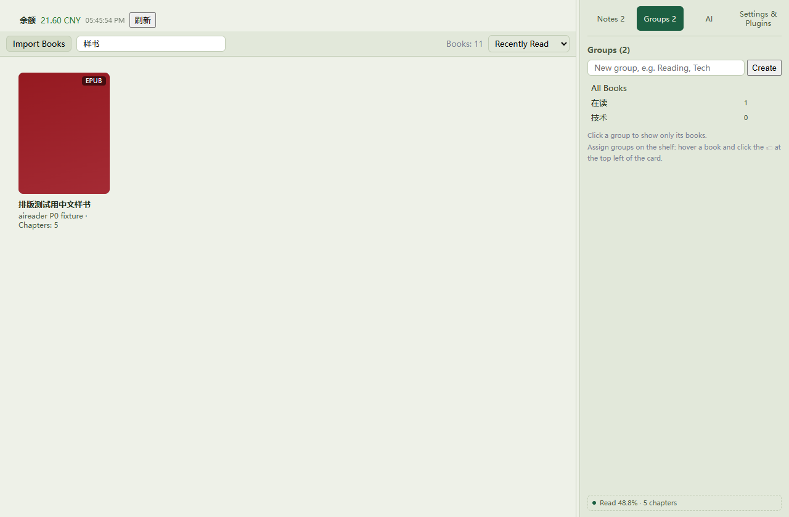
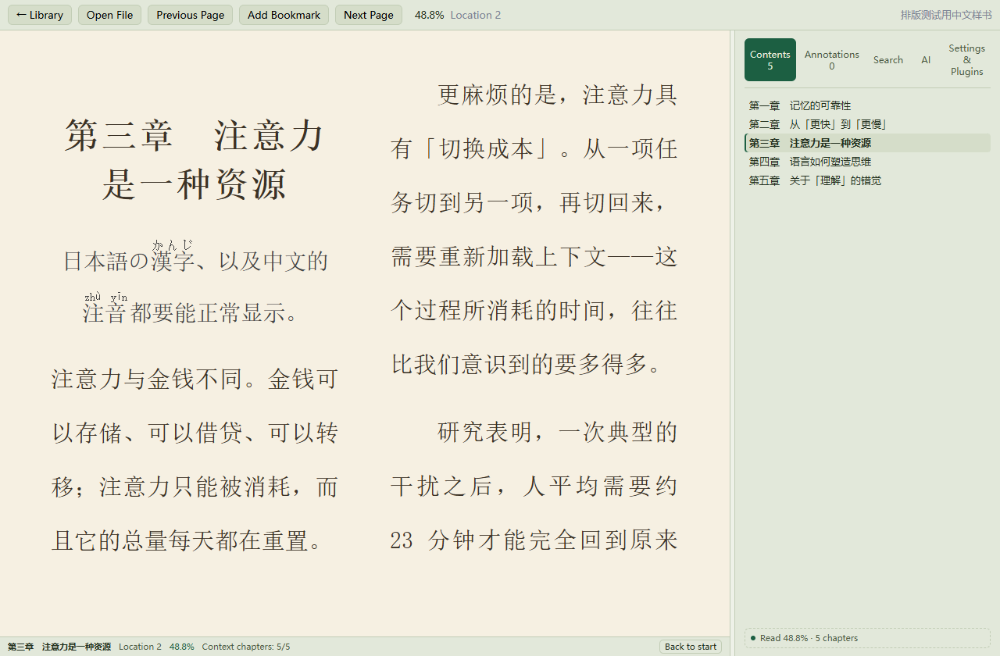

# JingJing

A local-first desktop reader. Your books, highlights, reading positions and AI key all stay on your own computer.



Windows 10/11 · [Download the latest release](https://github.com/54RuiCao/JingJing/releases/latest) · MIT

[中文](README.md#中文) · English · [Bilingual page](README.md)

The interface follows your system language (Chinese / English) and you can switch it any time under Settings.

## Reading

- Import EPUB / TXT / MOBI / FB2 / CBZ; TXT is converted to EPUB on import
- Table of contents, full-text search, highlights / notes / bookmarks and reading position are stored in a local SQLite file — works offline
- Three themes (day / sepia / night); font size, line height, page width and justification are all adjustable
- Group books into shelves; the home sidebar has a cross-book note overview (click a note to jump back to the passage) and shelf management



## AI

Bring a DeepSeek key, or point it at any OpenAI-compatible endpoint, or a local Ollama.

- The whole book goes into context chapter by chapter, and `[CH 12]` inside an answer jumps back to the source
- Tools can read chapters, search the full text, write highlights and notes, and jump around the book; every call, its tokens and its cost are shown in the panel
- Very long books fall back to "table of contents + fetch chapters on demand"

The first question about a book is the expensive one — the whole book is read into context. After that it is cached and cheap.

## Plugins

Every part of the interface and every AI tool is a plugin. Built-in and third-party plugins go through the same load, unload and rollback path.

**The AI can write one for you on the spot.** Ask it to "add a strip at the bottom of the reading area showing how many pages are left in this chapter": it looks up the API and the slots available, writes the plugin, runs it, then stops and waits for your grant (nothing is granted by default). Happy with the result? "Keep in plugin folder" makes it permanent, just like a built-in.

Plugins run in a quickjs-ng (WASM) sandbox: every capability has to be declared in the manifest, everything is denied by default, and revoking a grant stops the plugin immediately. Network access works the same way — a plugin declares the domains it wants and you grant them one by one. A plugin can also use the AI key you configured: the host fills it in, so the key never reaches the plugin.

Writing your own: see [docs/plugin-api.md](docs/plugin-api.md) ([English](docs/plugin-api.en.md)).

## Not supported

- PDF (deliberately out of scope); no book sources, no DRM removal
- Windows only for now; an Android version is in development
- The plugin sandbox is API discipline, not a security boundary — it stops mistakes, not malicious code

## Build from source

Needs Node 20+, a stable Rust toolchain and, on Windows, WebView2.

```bash
cd app
npm install
npm run tauri dev      # development
npm run tauri build    # produces the exe and the MSI
npm test               # contract tests, no browser needed
npx tsc --noEmit       # type check
```

```
app/     Tauri app (React front end; the Rust side owns SQLite and book files)
vendor/  fork of foliate-js (MIT upstream, changes recorded in LOCAL-CHANGES.md)
tools/   contract tests, CDP probes, local mocks
docs/    plugin documentation
```

## License

MIT. The bundled rendering engine [foliate-js](https://github.com/johnfactotum/foliate-js) and the runtime
[quickjs-ng](https://github.com/quickjs-ng/quickjs) are MIT as well.
