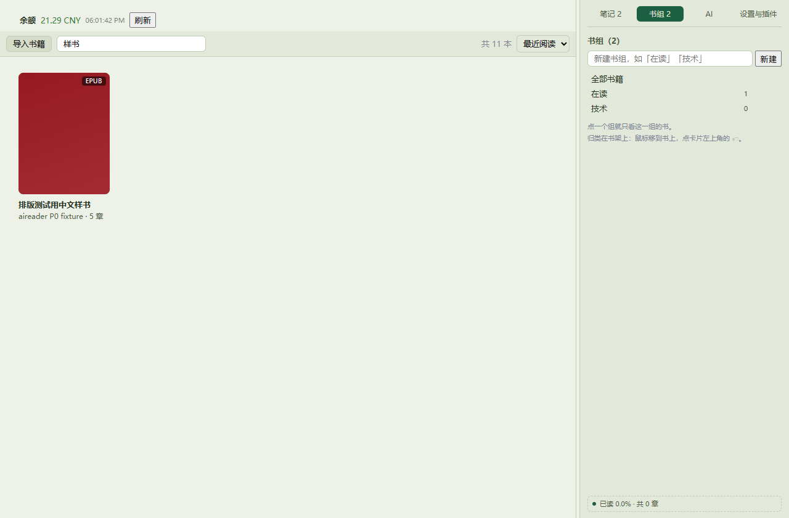
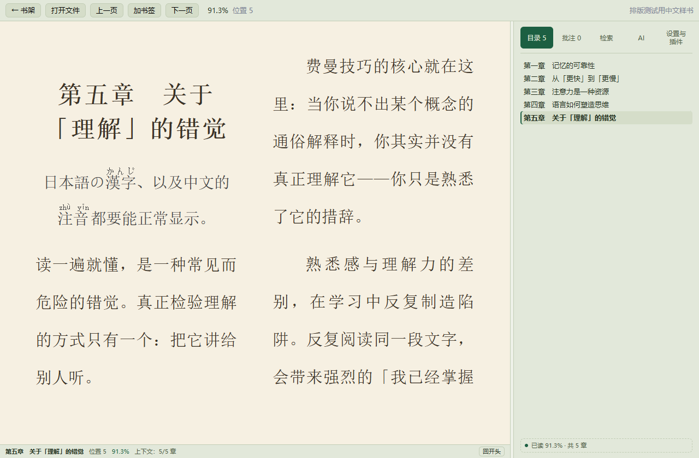

# 鲸鲸 / JingJing

本地优先的桌面阅读器：书、批注、进度和 AI 密钥都留在你自己的电脑上。
A local-first desktop reader. Your books, highlights, reading positions and AI key all stay on your own computer.

**语言 / Language：[中文 ↓](#中文) · [English ↓](#english)**

Windows 10/11 · [下载最新版 / Download](https://github.com/54RuiCao/JingJing/releases/latest) · MIT

界面语言跟随系统（中文 / English），也可以随时在「设置与插件」里手动切换。
The interface follows your system language and can be switched any time under Settings.



---

## 中文

### 阅读

- 导入 EPUB / TXT / MOBI / FB2 / CBZ，TXT 会先转成 EPUB 再读
- 目录、全文检索、划线 / 笔记 / 书签、阅读进度，都存在本机 SQLite 里，断网照常
- 三套主题（日间 / 护眼 / 夜间），字号、行距、页宽、两端对齐等排版项都能调
- 书库能按书组归类；主页侧栏放着笔记总览（跨书汇总，点一条跳回原文）和书组管理



### AI

填一个 DeepSeek Key 就能用，也支持 OpenAI 兼容接口和本地 Ollama。

- 整本书按章节进上下文，回答里的 `[CH 12]` 点一下就跳回原文
- 工具能读章节、全文检索、写划线笔记、跳转位置；每一步调用、token 和花费都显示在面板上
- 太长的书自动降级成「目录 + 按需取正文」

第一次提问要把整本书读进上下文，比较贵；之后靠缓存，很便宜。

### 插件

界面上的每一块、AI 的每一个工具，都是插件。内置插件和第三方插件走同一条加载、卸载、回滚路径。

**AI 能当场给你写一个。** 对它说「在阅读区底部加一块显示当前这一章还剩多少页」，
它会自己查现场的 API 和槽位、写出来、跑起来，然后停下来等你授权（默认什么权限都不给）。
满意了点「保留到插件目录」，它就跟内置插件一样常驻了。

插件跑在 quickjs-ng（WASM）沙箱里：能力必须写在 manifest 里、默认拒绝、撤销后立刻停。
要联网的插件也一样，先写清访问哪些域名，由你逐个授权；想用你配置的 AI Key 也可以，
Key 由宿主代填，不会交给插件。

自己写插件看 [docs/plugin-api.md](docs/plugin-api.md)（[English](docs/plugin-api.en.md)）。

### 不支持

- PDF（明确不做）；不提供书源，也不移除 DRM
- 目前只有 Windows，Android 版在开发中
- 插件沙箱是 API 纪律，不是安全边界，它防手滑，不防恶意代码

### 免责声明

- **只做本地阅读**：鲸鲸**不提供书源**、不搜索、不下载、也不移除 DRM；它只打开**你自己导入**的文档。
  请只导入你合法拥有或有权阅读的文件，导入与使用产生的后果由使用者自负。
- **插件免责**：插件（内置的、第三方安装的，以及 AI 当场写出来的）由**各自的作者**负责。
  插件沙箱是 **API 纪律，不是安全边界** —— 它防手滑，不防恶意代码；安装、授权第三方或 AI 生成的
  插件之前请自行判断，作者不对插件的行为与后果负责。
- **AI 输出**：AI 的回答、以及它写出来的插件代码都由模型生成，**可能有错**，请自行核对
  （尤其涉及会花钱的接口时）。
- 软件按 MIT 许可**按现状提供**，不附带任何形式的担保。

### 从源码构建

需要 Node 20+、Rust 稳定版，Windows 上还需要 WebView2。

```bash
cd app
npm install
npm run tauri dev      # 开发
npm run tauri build    # 出 exe 和 MSI
npm test               # 契约测试，不需要浏览器
npx tsc --noEmit       # 类型检查
```

```
app/     Tauri 应用（React 前端；Rust 侧管 SQLite 与书籍文件）
vendor/  foliate-js 的 fork（上游 MIT，改动记在 LOCAL-CHANGES.md）
tools/   契约测试、CDP 探针、本地 mock
docs/    插件开发文档
```

### 许可

MIT。内置的渲染引擎 [foliate-js](https://github.com/johnfactotum/foliate-js) 和运行时
[quickjs-ng](https://github.com/quickjs-ng/quickjs) 也是 MIT。

---

## English


### Reading

- Import EPUB / TXT / MOBI / FB2 / CBZ; TXT is converted to EPUB on import
- Table of contents, full-text search, highlights / notes / bookmarks and reading position are stored in a local SQLite file — works offline
- Three themes (day / sepia / night); font size, line height, page width and justification are all adjustable
- Group books into shelves; the home sidebar has a cross-book note overview (click a note to jump back to the passage) and shelf management


### AI

Bring a DeepSeek key, or point it at any OpenAI-compatible endpoint, or a local Ollama.

- The whole book goes into context chapter by chapter, and `[CH 12]` inside an answer jumps back to the source
- Tools can read chapters, search the full text, write highlights and notes, and jump around the book; every call, its tokens and its cost are shown in the panel
- Very long books fall back to "table of contents + fetch chapters on demand"

The first question about a book is the expensive one — the whole book is read into context. After that it is cached and cheap.

### Plugins

Every part of the interface and every AI tool is a plugin. Built-in and third-party plugins go through the same load, unload and rollback path.

**The AI can write one for you on the spot.** Ask it to "add a strip at the bottom of the reading area showing how many pages are left in this chapter": it looks up the API and the slots available, writes the plugin, runs it, then stops and waits for your grant (nothing is granted by default). Happy with the result? "Keep in plugin folder" makes it permanent, just like a built-in.

Plugins run in a quickjs-ng (WASM) sandbox: every capability has to be declared in the manifest, everything is denied by default, and revoking a grant stops the plugin immediately. Network access works the same way — a plugin declares the domains it wants and you grant them one by one. A plugin can also use the AI key you configured: the host fills it in, so the key never reaches the plugin.

Writing your own: see [docs/plugin-api.md](docs/plugin-api.md) ([English](docs/plugin-api.en.md)).

### Not supported

- PDF (deliberately out of scope); no book sources, no DRM removal
- Windows only for now; an Android version is in development
- The plugin sandbox is API discipline, not a security boundary — it stops mistakes, not malicious code

### Disclaimer

- **Local reading only.** JingJing ships **no book sources**, does not search for or download books, and
  does not remove DRM. It only opens documents **you import yourself**. Please import only files you
  legally own or are entitled to read; you are responsible for what you do with them.
- **Plugins.** Built-in, third-party and AI-written plugins are the responsibility of **their respective
  authors**. The plugin sandbox is **API discipline, not a security boundary** — it stops mistakes, not
  malicious code. Judge for yourself before installing or granting anything; the authors accept no
  liability for what a plugin does.
- **AI output.** Answers and generated plugin code come from a model and **can be wrong** — check them
  yourself, especially anything that spends money.
- The software is provided **as is**, under the MIT license, without warranty of any kind.

### Build from source

Needs Node 20+, a stable Rust toolchain and, on Windows, WebView2.

```bash
cd app
npm install
npm run tauri dev      # development
npm run tauri build    # produces the exe and the MSI
npm test               # contract tests, no browser needed
npx tsc --noEmit       # type check
```

```
app/     Tauri app (React front end; the Rust side owns SQLite and book files)
vendor/  fork of foliate-js (MIT upstream, changes recorded in LOCAL-CHANGES.md)
tools/   contract tests, CDP probes, local mocks
docs/    plugin documentation
```

### License

MIT. The bundled rendering engine [foliate-js](https://github.com/johnfactotum/foliate-js) and the runtime
[quickjs-ng](https://github.com/quickjs-ng/quickjs) are MIT as well.

---

## 赞赏支持 / Support

鲸鲸是**免费开源**的，**没有任何付费功能** —— 所有功能对所有人开放，赞赏与否完全不影响使用。
如果它对你有帮助，你可以**自愿**扫码支持开发与维护，谢谢。

JingJing is **free and open source with no paid features** — everything is available to everyone, and
supporting it changes nothing about the software. If it helps you, you may **voluntarily** scan a code
below to support its development and maintenance. Thank you.

<p align="center">
  
  &nbsp;&nbsp;&nbsp;
  
</p>

---

> 这一页是中英双语：改文案时**两边都要改**。纯英文版另存为 [README.en.md](README.en.md)。
> This page is bilingual: when you edit it, **update both halves**. A standalone English copy lives in [README.en.md](README.en.md).
